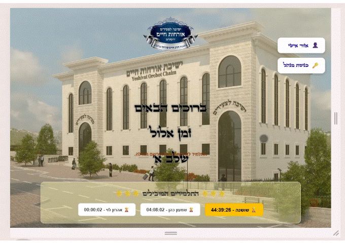
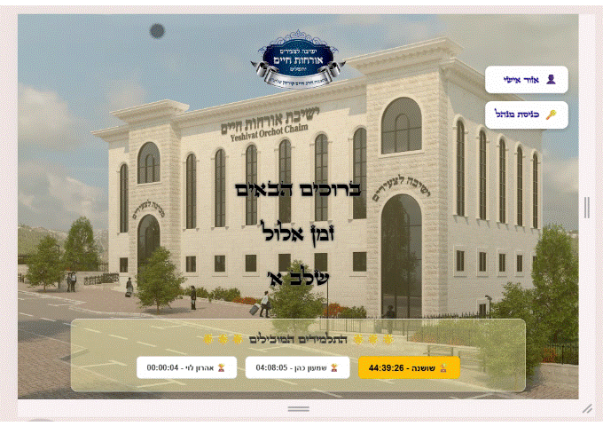
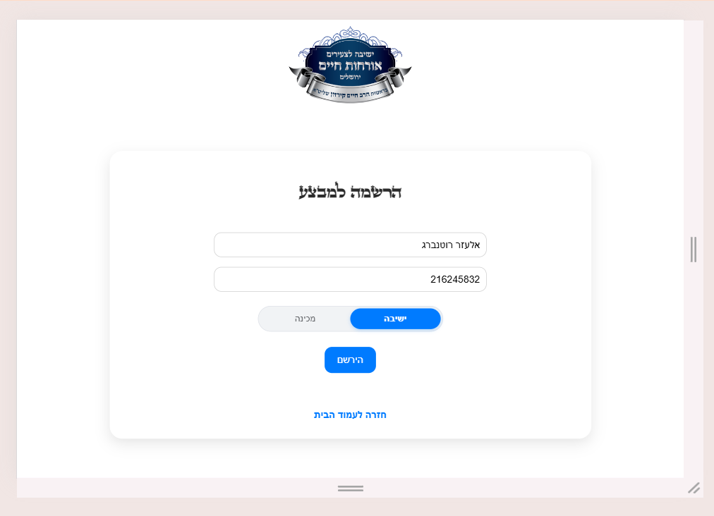
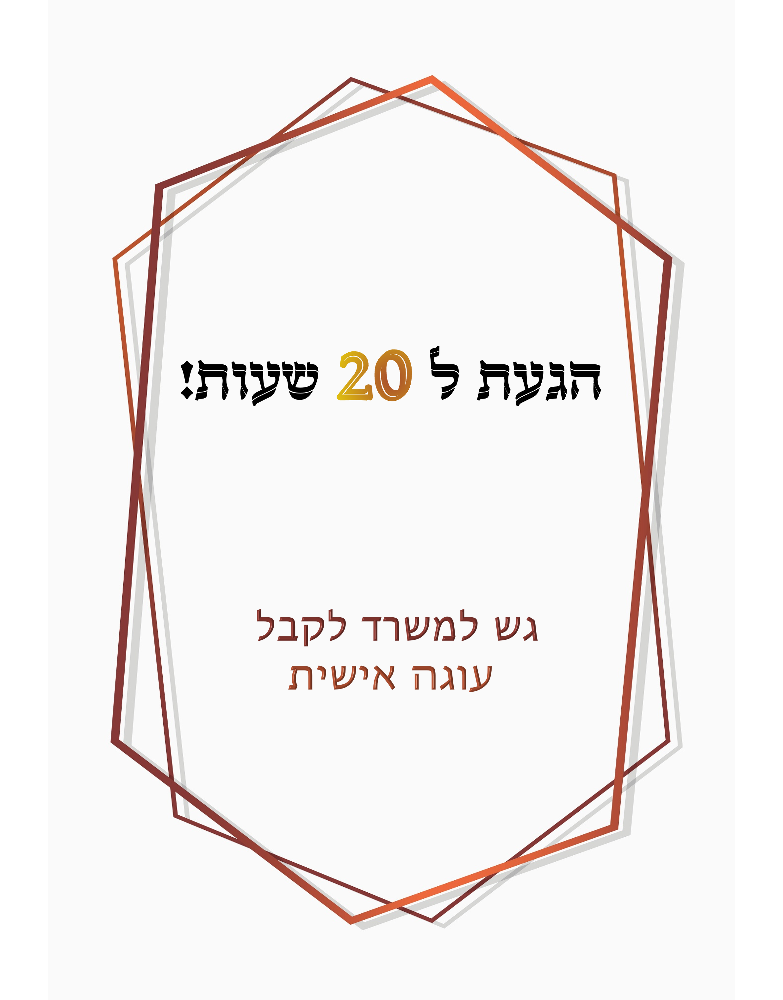
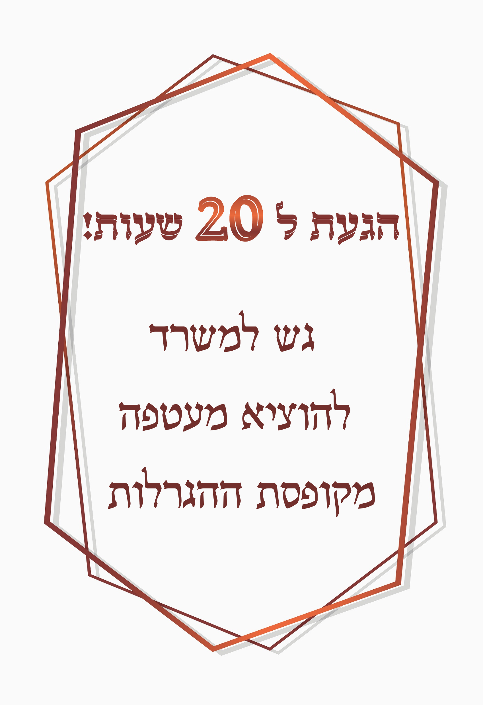

# ⏱️ Time Manager & Validation System

<p align="center">
  
</p>

<p align="center">
  <b>מערכת לניהול זמן, תיקוף תלמידים, צבירת נקודות, מעקב והגרלות</b>
</p>

<p align="center">
  
</p>


---

## 📖 על הפרויקט

**Time Manager & Validation System** היא מערכת אינטרנטית לניהול ומעקב אחר השתתפות וזמן של תלמידים במסגרת מבצע או תוכנית.

המערכת מאפשרת לתלמידים לבצע תיקוף באמצעות מזהה אישי, לצבור נקודות בהתאם לזמני הפעילות, לצפות באזור האישי שלהם ולעקוב אחר ההתקדמות.

בנוסף, המערכת כוללת **אזור ניהול מתקדם**, המאפשר למנהל לשלוט בנתוני המשתמשים, זמני התיקוף, שלבי המבצע, נקודות, מתנות והגרלות.

---

# ✨ יכולות מרכזיות

## 👤 עבור תלמידים

* 🔐 זיהוי באמצעות מזהה אישי
* ⏱️ תיקוף השתתפות וצבירת נקודות
* 📊 צפייה באזור האישי
* 🏆 הצגת תלמידים מובילים
* 🎯 מעקב אחר התקדמות
* 🎁 השתתפות במערכת מתנות והגרלות

## 👨‍💼 עבור מנהלים

* 🔑 כניסת מנהל מאובטחת
* 💳 הוספה ועדכון של נקודות
* 🕒 הגדרת זמני תיקוף
* 📍 ניהול שלבים במבצע
* 🆔 שינוי מזהה תלמיד
* 🎁 ניהול מתנות
* 🎉 הגדרת פרסים והגרלות
* 📜 צפייה בהיסטוריית זכיות
* 📝 מעבר מהיר לרישום תלמידים
* 📊 צפייה בנתוני כלל התלמידים

---

# 🏠 דף הבית

דף הבית משמש כנקודת הכניסה הראשית למערכת.

במסך הבית המשתמש יכול:

* לבצע פעולות תיקוף באמצעות המזהה האישי
* לראות הודעות ועדכונים
* לצפות ברשימת התלמידים המובילים
* להיכנס לאזור האישי
* לגשת לאזור הניהול

<p align="center">
  
</p>

---

# 🏆 תלמידים מובילים

המערכת כוללת תצוגה של התלמידים בעלי מספר הנקודות הגבוה ביותר.

רשימת התלמידים המובילים מאפשרת ליצור:

* מוטיבציה להשתתפות
* מעקב אחר התקדמות
* תחרות חיובית בין המשתתפים
* תצוגה ברורה של הישגים

התלמיד בעל הניקוד הגבוה ביותר מודגש באופן בולט.

---

# 👤 אזור אישי

האזור האישי מאפשר לכל תלמיד לצפות במידע האישי שלו.

באמצעות המזהה האישי ניתן לקבל גישה למידע כגון:

* פרטי תלמיד
* נקודות שנצברו
* זמן שנצבר
* סטטוס התקדמות
* נתונים נוספים הקשורים להשתתפות במבצע
<p align="center">
  
</p>
---

# ⏱️ מערכת תיקוף

מערכת התיקוף מאפשרת לתלמיד להזדהות באמצעות מזהה אישי ולבצע פעולה של תיקוף השתתפות.

תהליך העבודה:

1. התלמיד מזין את המזהה האישי.
2. המערכת בודקת את הנתונים.
3. מתבצע תיקוף בהתאם להגדרות.
4. הנקודות מתעדכנות.
5. מוצגת הודעה למשתמש.

עמוד התיקוף כולל שדה להזנת מזהה וכפתור לביצוע פעולת התיקוף.

---

# 📝 רישום תלמידים

המערכת כוללת מסך רישום ייעודי.

במהלך הרישום ניתן להזין:

* שם תלמיד
* מזהה תלמיד
* סוג מוסד

המערכת כוללת גם מקלדת מותאמת אישית, המאפשרת שימוש נוח גם בסביבה שבה אין צורך או אפשרות להשתמש במקלדת רגילה.

<p align="center">
  
</p>

---

# 👨‍💼 אזור הניהול

אזור הניהול הוא מרכז השליטה של המערכת.

לאחר התחברות, המנהל מקבל גישה ללוח בקרה הכולל מגוון פעולות ניהול.

<p align="center">
  
</p>

## אפשרויות הניהול

### 💳 ניהול נקודות

המנהל יכול:

* לבחור תלמיד באמצעות מזהה
* להוסיף שעות
* להוסיף דקות
* לעדכן את מאזן הנקודות

---

### 🕒 הגדרות תיקוף

אפשרות להגדרת זמני פעילות ותנאים לביצוע תיקוף.

הניהול מאפשר שליטה טובה יותר על:

* זמני כניסה
* זמני יציאה
* זמני פעילות
* תנאי צבירת נקודות

---

### 📍 ניהול שלבים

המערכת מאפשרת לנהל את השלב הנוכחי של המבצע.

כך ניתן לעדכן את התקדמות המבצע ולהציג למשתמשים את המידע הרלוונטי.

---

### 🆔 שינוי מזהה תלמיד

במקרה הצורך, מנהל המערכת יכול להחליף או לעדכן את המזהה של תלמיד.

אפשרות זו שימושית במקרים כגון:

* החלפת כרטיס
* אובדן מזהה
* תיקון נתונים
* שינוי מזהה קיים

---

### 🎁 ניהול מתנות

מערכת ייעודית לניהול המתנות הקיימות במבצע.

המנהל יכול לנהל את רשימת המתנות והפרסים הזמינים למשתתפים.

---

### 🎉 הגרלות וזכיות

אזור הניהול כולל אפשרויות להגדרת זכיות ופרסים.

בנוסף, קיימת אפשרות לצפות בהיסטוריית הזכיות.

כך ניתן לנהל:

* פרסים
* זכיות
* הגרלות
* היסטוריית זוכים

---

### 📊 צפייה בכל התלמידים

המנהל יכול להציג מידע על כלל התלמידים במערכת.

אפשרות זו מאפשרת לקבל תמונה כללית על המשתתפים והנקודות שלהם.

---

# 🖼️ גלריית תמונות

## דף הבית

<p align="center">
  
</p>

## אזור הניהול

<p align="center">
  
</p>

## מסכים נוספים

<p align="center">
  
  
</p>

---

# 📁 מבנה הפרויקט

```text
Time-Manager-and-Validation-System/
│
├── assets/                  # קבצי משאבים
│
├── css/                     # קבצי עיצוב
│   ├── homePage.css
│   ├── manager.css
│   ├── register.css
│   └── validate.css
│
├── images/                  # תמונות ולוגואים
│   ├── 10.png
│   ├── 10b.png
│   ├── 20.png
│   ├── 20b.png
│   ├── gift.png
│   ├── goal.png
│   └── logo.png
│
├── js/                      # לוגיקת JavaScript
│   ├── db.js
│   ├── homePage.js
│   ├── register.js
│   └── ...
│
├── pages/                   # עמודי המערכת
│   ├── manager.html
│   ├── register.html
│   ├── studentInfo.html
│   └── validate.html
│
└── index.html               # דף הבית
```

---

# 🛠️ טכנולוגיות

הפרויקט מבוסס על טכנולוגיות Web סטנדרטיות:

* **HTML5**
* **CSS3**
* **JavaScript**
* ממשק משתמש מותאם לשפה העברית
* תמיכה בפריסת **RTL**
* מערכת ניהול נתונים באמצעות JavaScript

---

# 🚀 הרצה מקומית

אין צורך בתהליך Build מורכב.

### 1. שכפול הפרויקט

```bash
git clone https://github.com/shani01846/Time-Manager-and-Validation-System.git
```

### 2. כניסה לתיקיית הפרויקט

```bash
cd Time-Manager-and-Validation-System
```

### 3. פתיחת המערכת

ניתן לפתוח את:

```text
index.html
```

בדפדפן.

מומלץ להשתמש בשרת מקומי, לדוגמה באמצעות:

```bash
npx serve
```

או באמצעות תוסף **Live Server** ב-VS Code.

---

# 🧭 עמודים מרכזיים

| עמוד                     | תיאור                         |
| ------------------------ | ----------------------------- |
| `index.html`             | דף הבית והכניסה הראשית למערכת |
| `pages/validate.html`    | תיקוף תלמידים                 |
| `pages/register.html`    | רישום תלמידים                 |
| `pages/studentInfo.html` | אזור אישי                     |
| `pages/manager.html`     | אזור הניהול                   |

---

# 🎯 מטרות המערכת

המערכת נועדה ליצור חוויית ניהול פשוטה ונוחה עבור מסגרת שבה נדרש:

* לעקוב אחר זמני השתתפות
* לבצע זיהוי משתמשים
* לצבור נקודות
* להציג מובילים
* לנהל שלבים
* להפעיל מערכת פרסים והגרלות
* לספק למנהל ממשק שליטה מרכזי

---

# 🔮 אפשרויות להמשך פיתוח

אפשר להרחיב את המערכת בעתיד באמצעות:

* 📱 התאמה מלאה למובייל
* 🔐 מערכת התחברות עם משתמשים והרשאות
* ☁️ חיבור למסד נתונים בענן
* 📊 גרפים וסטטיסטיקות מתקדמות
* 📈 מערכת דוחות
* 🔔 התראות בזמן אמת
* 🏆 טבלת דירוג מפורטת
* 📅 היסטוריית פעילות
* 📤 ייצוא נתונים ל-Excel או CSV
* 🌐 ממשק API
* 👥 ניהול משתמשים והרשאות מתקדם

---

# 🤝 תרומה לפרויקט

תרומות ושיפורים לפרויקט יתקבלו בברכה.

ניתן:

1. לבצע Fork לפרויקט
2. ליצור Branch חדש
3. לבצע את השינויים
4. לבצע Commit
5. לפתוח Pull Request

---

<p align="center">
  <b>⭐ אם אהבתם את הפרויקט, מוזמנים לתת Star ב-GitHub!</b>
</p>

<p align="center">
  Made with ❤️ using HTML, CSS & JavaScript
</p>
